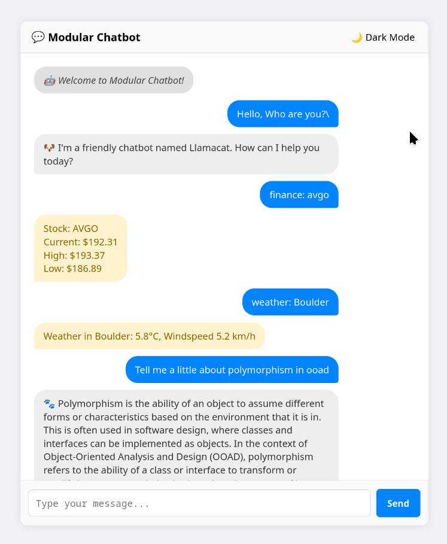
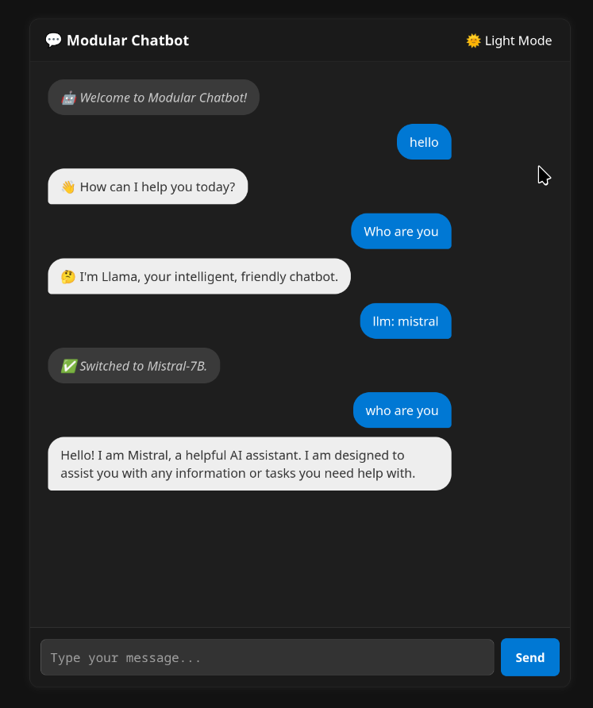

# Modular Chatbot Framework

A modern, adaptable chatbot framework powered by large language models (LLMs) with plugin-based extensibility — now with a beautiful web interface.

This project reimagines the traditional chatbot experience using a modular Java backend, a plugin system, and a sleek React-based web frontend. Users can interact with the bot in real time while dynamically using plugin-powered commands like `weather:`, `finance:`, and more.

---

## Features

- **Plugin-Based Design** — Add or remove functionality like weather or finance data retrieval at runtime
- **LLM Integration** — Interact with transformer-based models like TinyLLaMA
- **Hot-Swappable Modules** — Switch models or extend functionality without restarting the backend
- **Modern Web UI** — Built with React and plain CSS, including light/dark theme toggle
- **Command Routing** — Use natural commands like `weather: New York` or `finance: AAPL`

---

## Screenshots





---

## Setup & Dependencies

### Backend (Java 17+, Gradle)

**Required Dependencies (in `build.gradle`):**

```groovy
implementation 'org.springframework.boot:spring-boot-starter-web'
implementation 'org.json:json:20231013'
implementation 'de.kherud:llama:4.1.0'
implementation 'com.googlecode.lanterna:lanterna:3.1.1' // optional
testImplementation 'org.junit.jupiter:junit-jupiter'    // optional
```

**Minimum Java version:** `17`  
**Build system:** `Gradle`

**To build the project:**

just run the Application.java file to start the springboot server.

---

### Supported Models

This project supports **quantized `.gguf` LLMs** compatible with `llama.cpp` via the `de.kherud.llama` Java binding.  
Place your model files in a folder named `models/` at the root of the project.

#### 1. TinyLLaMA 1.1B Chat
- **Filename:** `tinyllama-1.1b-chat-v1.0.Q6_K.gguf`
- **Location:** `models/tinyllama-1.1b-chat-v1.0.Q6_K.gguf`
- **Source:** [Hugging Face - TinyLLaMA](https://huggingface.co/TinyLlama/TinyLlama-1.1B-Chat-v1.0)

#### 2. Mistral 7B Instruct
- **Filename:** `mistral-7b-instruct-v0.1.Q4_K_M.gguf`
- **Location:** `models/mistral-7b-instruct-v0.1.Q4_K_M.gguf`
- **Source:** [TheBloke - Mistral 7B](https://huggingface.co/TheBloke/Mistral-7B-v0.1-GGUF)

> You can switch models at runtime by typing:
>
> ```
> llm: tinyllama
> llm: mistral
> ```

> You can the plugins at runtime by typing:
>
> ```
> finance: stock 
> weather: location
> ```


---

### Frontend (React + Plain CSS)

**Frontend Stack:**
- React (via `create-react-app`)
- Plain CSS
- `fetch()` for API interaction

**To install and run the frontend:**

```bash

cd chatbot-ui
npm install
npm start

```

> Make sure the backend is running on `http://localhost:8080` when using the web UI.

---

## Tech Stack

| Layer        | Technology                                               |
|--------------|----------------------------------------------------------|
| **Backend**  | Java, Spring Boot, Llama4J (TinyLLaMA wrapper)           |
| **Frontend** | React, Plain CSS (no framework)                          |
| **LLM**      | TinyLLaMA + Mistral-7B (quantized GGUF format)           |
| **Plugins**  | Custom Java plugins (e.g., WeatherPlugin, FinancePlugin) |
| **API**      | RESTful JSON interface via Spring Boot                   |

---

